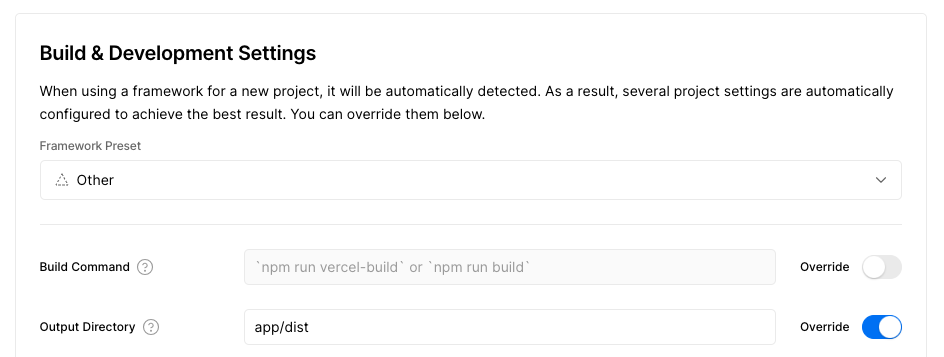

# vite-vercel-serverless

This is a boilerplate for vite + vercel serverless. It uses turborepo and vercel which should be globally installed:

```bash
pnpm add -g turbo vercel
```

## Usage

```bash
vercel dev
```

When you first run this you will need to link-to or create a vercel project.

## Deployment

To make sure deploying works correctly, make sure you've set the output directory in the vercel project settings.



## Shared Workspace

It contains a package called `shared` which is a workspace that can be used by other packages.

---

I built this because I was tired of scaffolding vite/vercel projects by myself.

## Contributing

If you have any questions, feel free to open an issue or a PR.

---

## To Do

Keeping notes here for things I'm always doing in these projects.

- Add vercel.json for deployments
- Add and link node types to /api
